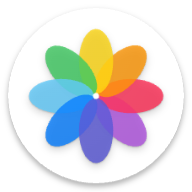
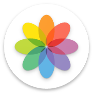

<div align="center">

  


# Right Gallery/Alright Gallery
<a href='https://play.google.com/store/apps/details?id=com.goodwy.gallery'></a>  <a href='https://play.google.com/store/apps/details?id=dev.goodwy.gallery'></a>
</div>

Your private moments are protected. Discover Right Gallery/Alright Gallery, where your privacy is our priority. <br><br>

## ☕ Support the Project

If you find **Right Gallery/Alright Gallery** useful and would like to support its development, consider
buying me a coffee! Your support helps me maintain and improve this project.

[](https://www.buymeacoffee.com/goodwy)

*Every contribution, no matter how small, helps keep this project alive and growing! ❤️*<br><br><br>


*Based on [Simple Gallery](https://github.com/SimpleMobileTools/Simple-Gallery), [Fossify Gallery](https://github.com/FossifyOrg/Gallery).*

## Build no Termux

O arquivo `local.properties` não deve ser versionado, pois o caminho do Android SDK varia entre computadores. No Termux, configure o SDK localmente antes de compilar:

```sh
export ANDROID_HOME="$HOME/Android/Sdk"
export ANDROID_SDK_ROOT="$ANDROID_HOME"
export PATH="$ANDROID_HOME/platform-tools:$ANDROID_HOME/cmdline-tools/latest/bin:$PATH"
./gradlew :app:assembleFossDebug
```

A variante FOSS produz um APK de depuração sem assinatura de release. Para distribuição, configure as variáveis de assinatura documentadas no `app/build.gradle.kts` e utilize a variante correspondente.
